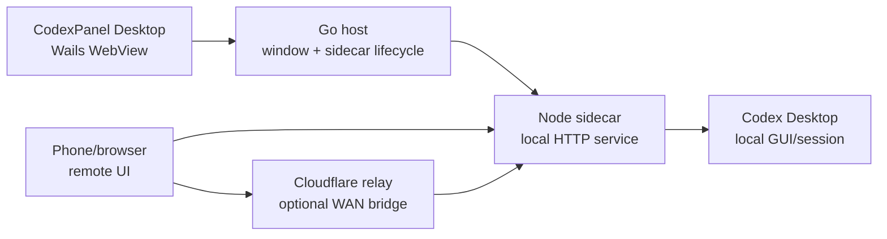

# CodexPanel

[中文](README.md) | English

CodexPanel is a local desktop control panel for controlling the Codex Desktop
app from another device. The desktop app manages a local Node sidecar service,
shows the local/remote entry points, and keeps secrets out of release bundles.
The remote control surface is still opened from a phone or another browser.

This repository contains the open local-control implementation:

- Wails desktop shell for Windows, Linux, and macOS.
- Go process manager for the Node sidecar.
- Node local service for Codex Desktop automation and browser APIs.
- Reused Web frontend for the local panel and remote mobile control page.
- WAN relay deployment maintained in the separate `CodexPanel-WAN` repository.
- GitHub Actions desktop release builds.

## Current Status

- Project name: `CodexPanel`
- Desktop package: Wails portable bundle plus Windows installer
- Windows installer: `CodexPanel-Setup-<version>.exe`
- Windows portable output: `CodexPanel.exe` plus `codexpanel-node-sidecar.exe`
- Local panel: desktop WebView, no browser jump required
- Remote control: browser/mobile page through LAN or Cloudflare relay
- Local service controls: start and stop are handled by the desktop client

## Architecture



The desktop window serves `public/control.html` through the Wails asset server.
Go owns the sidecar process and proxies `/codex/*` requests to the local Node
service, so desktop buttons can start and stop the service without asking the
user to open a terminal.

The Node sidecar serves:

- `public/control.html` for the desktop control panel.
- `public/index.html` for the remote/mobile control page.
- `/codex/control-status` for service status.
- `/codex/control-config` for local panel configuration.
- `/codex/service-check` for diagnostics.
- Codex thread, send, stop, file, and automation endpoints used by the remote UI.

## How It Works

1. `CodexPanel.exe` starts.
2. Go reads the saved local panel config from `~/.codex/state.json`.
3. Go generates a local control token for the WebView session.
4. Go starts `codexpanel-node-sidecar` with runtime environment variables.
5. The sidecar runs the local HTTP service on the configured port.
6. The desktop WebView opens the embedded control panel and receives the token
   through Wails bindings.
7. The panel displays status, local entry, remote entry, PID, device ID, and uptime.
8. The phone opens the LAN URL or the Cloudflare WAN URL in a browser.
9. The sidecar talks to Codex Desktop in the current logged-in desktop session.

The local token is generated at runtime and is not packaged. The remote key and
Cloudflare URL are user configuration values and are read from local state or
environment variables when the sidecar starts.

## What Is Not Packaged

The build scripts deliberately refuse to bundle user state or secrets:

- `.env`
- `.env.local`
- `.env.production`
- `state.json`
- `.codex/`

Generated binaries and local deployment files are also ignored by git:

- `build/bin/`
- `build/tmp/`
- `frontend/wailsjs/`
- `.build/`
- `cloudflare/wrangler.toml`
- `cloudflare/pages/wrangler.toml`

Commit `*.example` files for deployment templates. Keep real keys and local
Cloudflare account configuration outside the repository.

## Requirements

Desktop development:

- Node.js 18+
- Go 1.23+
- Wails CLI v2.12+
- Windows: Microsoft Edge WebView2 Runtime
- Windows installer builds: Inno Setup 6
- Linux: GTK/WebKitGTK development packages
- macOS: Xcode command line tools

Ubuntu development support is documented in [docs/UBUNTU_DEVELOPMENT.md](docs/UBUNTU_DEVELOPMENT.md).

## Local Development

Install dependencies:

```powershell
npm ci
```

Run syntax checks:

```powershell
npm run check
node --check windows/node-sidecar.js
```

Run the Wails desktop app in development mode:

```powershell
npm run wails:dev
```

Build the desktop app:

```powershell
npm run wails:build
npm run wails:sidecar
```

The portable desktop bundle is written to:

```text
build/bin/
```

Build the Windows installer:

```powershell
npm run installer:win
```

The installer is written to:

```text
dist/CodexPanel-Setup-<version>.exe
```

The portable Windows bundle contains two executables by design:

- `CodexPanel.exe`: the desktop control panel users launch.
- `codexpanel-node-sidecar.exe`: the bundled local service started and stopped
  by `CodexPanel.exe`; users do not run it manually.

For ordinary Windows users, publish the installer. Keep the portable zip for
development, diagnostics, and no-install usage.

## Service Controls

The desktop panel uses the Wails method `App.ControlService`.

Supported actions:

- `start`: starts the local sidecar if it is not healthy.
- `stop`: stops the sidecar and, on Windows, kills the full sidecar process tree.

The frontend keeps one primary service button:

- Running: button shows `停止`.
- Stopped: button shows `启动`.

Stopping the service immediately updates the panel state and releases the local
HTTP port.

## Configuration

The local panel stores user configuration in Codex state:

```text
~/.codex/state.json
```

Main fields:

- `port`: local service port, default `8787`.
- `relayUrl`: Cloudflare service URL, entered by the user.
- `remoteKey`: remote control key, entered by the user.
- `deviceId`: local device ID, defaulting to the Windows user name.

Do not hard-code these values into source or release bundles.

## WAN / Cloudflare Relay

LAN use does not require Cloudflare. For WAN access across different networks,
deploy the relay from the dedicated repository:

- [wintopic/CodexPanel-WAN](https://github.com/wintopic/CodexPanel-WAN)

Recommended setup flow:

1. Deploy `CodexPanel-WAN` to Cloudflare Pages + Durable Object Worker by
   following that repository's README.
2. After deployment, record the Cloudflare service root URL, for example
   `https://codexpanel-wan.pages.dev` or your custom domain.
3. Open CodexPanel desktop settings and fill in:
   - Cloudflare service URL: the root URL only, without `/remote/...`.
   - Remote key: a strong key chosen by the user.
4. Keep the desktop Device ID consistent with the device ID allowed in
   `CodexPanel-WAN` when `DEVICE_IDS` is configured.
5. Start the local service. The remote entry becomes:
   `https://<cloudflare-domain>/remote/<deviceId>/?token=<remote-key>`.

The computer is the controlled side and does not need an extra Cloudflare agent
secret. The WAN relay only queues and forwards requests; CodexPanel on the local
computer still validates the remote key and performs the actual Codex Desktop
automation.

Legacy relay examples remain in this repository for reference:

- [cloudflare/wrangler.toml.example](cloudflare/wrangler.toml.example)
- [cloudflare/pages/wrangler.toml.example](cloudflare/pages/wrangler.toml.example)
- [docs/cloudflare-relay.md](docs/cloudflare-relay.md)

Use `CodexPanel-WAN` as the source of truth for new WAN deployments.

## GitHub Actions

Desktop release packaging is automated in:

```text
.github/workflows/windows-release.yml
```

The workflow runs on every push to `main` and uploads desktop artifacts.
Windows publishes both an installer `.exe` and a portable `.zip`; Linux and
macOS are packaged as `.tar.gz` so executable permissions survive extraction.
It can also be run manually from the Actions tab.

When pushing a tag like `v3.0.5`, the workflow uploads the desktop bundles to a
GitHub Release automatically.

## Repository Layout

```text
main.go                    Wails app entrypoint
app.go                     Go sidecar lifecycle and Wails bindings
assets.go                  Embedded control panel and /codex proxy
process_*.go              Cross-platform process-tree handling

public/
  control.html              Desktop control panel
  index.html                Remote/mobile control page
  icons/                    App icons

server.js                   Local Node service
windows/node-sidecar.js     Sidecar entrypoint

build/
  appicon.png               Wails app icon source
  windows/                  Windows Wails metadata, icon, installer script

scripts/
  build-wails-sidecar.js    Packages the Node sidecar
  build-windows-installer.ps1 Builds the Windows installer
  setup-ubuntu-dev.sh       Ubuntu development bootstrap

cloudflare/
  relay-worker.mjs          Optional Durable Object relay
  pages/_worker.js          Optional Pages worker
```

## Release Checklist

Before publishing a desktop build:

1. Run `npm run check`.
2. Run `node --check windows/node-sidecar.js`.
3. Run `go test ./...`.
4. Run `npm run wails:build`.
5. Run `npm run wails:sidecar`.
6. On Windows, run `npm run installer:win`.
7. Verify the desktop panel shows the correct icon and project name.
8. Verify service diagnostics are `8/8`.
9. Verify `启动` and `停止` both work.
10. Verify no user keys or local state are present in the portable bundle or installer.

## License

CodexPanel is source-available for non-commercial use unless a separate written
commercial license is granted by the copyright holder. See [LICENSE](LICENSE).
