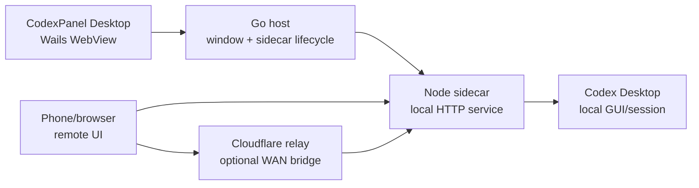

# CodexPanel

中文 | [English](README.en.md)

CodexPanel 是一个本地桌面控制面板，用于从手机或另一台设备控制当前电脑上的 Codex Desktop。桌面客户端负责管理本地 Node sidecar 服务、展示本地/远控入口，并确保密钥不会被打进发布包。远控界面仍然通过手机或浏览器打开。

本仓库包含本地控制面板的开源实现：

## 讨论交流

- 讨论地址：[linux.do](https://linux.do)

## 当前状态

- 项目名称：`CodexPanel`
- 桌面包形态：Wails 便携包 + Windows 安装包
- Windows 安装包：`CodexPanel-Setup-<version>.exe`
- Windows 便携包：`CodexPanel.exe` + `codexpanel-node-sidecar.exe`
- 本地面板：桌面 WebView，不需要跳转浏览器操作
- 远程控制：通过局域网或 Cloudflare 中转在浏览器/手机端打开
- 本地服务控制：启动和停止由桌面客户端执行

## 架构



桌面窗口通过 Wails asset server 承载 `public/control.html`。Go 负责 sidecar 进程，并把 `/codex/*` 请求反代到本地 Node 服务，因此桌面按钮可以直接启动和停止服务，不需要用户打开终端。

Node sidecar 提供：

- `public/control.html`：桌面控制面板。
- `public/index.html`：远端/移动控制页面。
- `/codex/control-status`：服务状态。
- `/codex/control-config`：本地面板配置。
- `/codex/service-check`：服务诊断。
- 远控页面需要的 Codex 线程、发送、停止、文件和自动化接口。

## 工作原理

1. `CodexPanel.exe` 启动。
2. Go 从 `~/.codex/state.json` 读取已保存的本地面板配置。
3. Go 为当前 WebView 会话生成本地控制 token。
4. Go 使用运行时环境变量启动 `codexpanel-node-sidecar`。
5. sidecar 在配置的端口上启动本地 HTTP 服务。
6. 桌面 WebView 打开内置控制面板，并通过 Wails 绑定获得 token。
7. 面板显示服务状态、本地入口、远控入口、PID、设备 ID 和运行时间。
8. 手机打开局域网 URL 或 Cloudflare 广域网 URL。
9. sidecar 在当前登录桌面会话中和 Codex Desktop 通信。

本地 token 在运行时生成，不会被打包。远控密钥和 Cloudflare URL 是用户配置项，只会在 sidecar 启动时从本地状态或环境变量读取。

## 环境要求

桌面开发：

- Node.js 18+
- Go 1.23+
- Wails CLI v2.12+
- Windows：Microsoft Edge WebView2 Runtime
- Windows 安装包构建：Inno Setup 6
- Linux：GTK/WebKitGTK 开发包
- macOS：Xcode command line tools

Ubuntu 开发支持见 [docs/UBUNTU_DEVELOPMENT.md](docs/UBUNTU_DEVELOPMENT.md)。

## 本地开发

安装依赖：

```powershell
npm ci
```

运行语法检查：

```powershell
npm run check
node --check windows/node-sidecar.js
```

以开发模式运行 Wails 桌面应用：

```powershell
npm run wails:dev
```

构建桌面应用：

```powershell
npm run wails:build
npm run wails:sidecar
```

便携桌面包输出到：

```text
build/bin/
```

构建 Windows 安装包：

```powershell
npm run installer:win
```

安装包输出到：

```text
dist/CodexPanel-Setup-<version>.exe
```

Windows 便携包里有两个可执行文件，这是设计如此：

- `CodexPanel.exe`：用户启动的桌面控制面板。
- `codexpanel-node-sidecar.exe`：由 `CodexPanel.exe` 启动和停止的本地服务，用户不需要手动运行。

普通 Windows 用户建议发布安装包。便携 zip 保留给开发、诊断和免安装场景。

## 服务控制

桌面面板通过 Wails 方法 `App.ControlService` 控制服务。

支持的操作：

- `start`：本地 sidecar 不健康或未运行时启动服务。
- `stop`：停止 sidecar；在 Windows 上会结束完整 sidecar 进程树。

前端保留一个主服务按钮：

- 运行中：按钮显示 `停止`。
- 已停止：按钮显示 `启动`。

停止服务后，面板会立即更新状态并释放本地 HTTP 端口。

## 配置

本地面板把用户配置保存在 Codex 状态文件中：

```text
~/.codex/state.json
```

主要字段：

- `port`：本地服务端口，默认 `8787`。
- `relayUrl`：用户输入的 Cloudflare 服务地址。
- `remoteKey`：用户输入的远控密钥。
- `deviceId`：本地设备 ID，默认使用 Windows 用户名。

不要把这些值硬编码进源码或发布包。

## 广域网 / Cloudflare 中转

局域网使用不需要 Cloudflare。跨网络广域网访问时，请从独立仓库部署中转服务：

- [wintopic/CodexPanel-WAN](https://github.com/wintopic/CodexPanel-WAN)

推荐配置流程：

1. 按照 `CodexPanel-WAN` 仓库 README，把中转服务部署到 Cloudflare Pages + Durable Object Worker。
2. 部署完成后记录 Cloudflare 服务根地址，例如 `https://codexpanel-wan.pages.dev` 或你的自定义域名。
3. 打开 CodexPanel 桌面设置并填写：
   - Cloudflare 服务地址：只填根地址，不要带 `/remote/...`。
   - 远控密钥：用户自行设置的强密钥。
4. 如果 `CodexPanel-WAN` 配置了 `DEVICE_IDS`，请保持桌面端设备 ID 与允许列表一致。
5. 启动本地服务。远控入口会变为：
   `https://<cloudflare-domain>/remote/<deviceId>/?token=<remote-key>`。

电脑端是被控端，不需要额外的 Cloudflare Agent 密钥。WAN 中转只负责排队和转发请求；CodexPanel 仍然在本机校验远控密钥，并执行真正的 Codex Desktop 自动化。

本仓库仍保留一些历史中转示例供参考：

- [cloudflare/wrangler.toml.example](cloudflare/wrangler.toml.example)
- [cloudflare/pages/wrangler.toml.example](cloudflare/pages/wrangler.toml.example)
- [docs/cloudflare-relay.md](docs/cloudflare-relay.md)

新的广域网部署请以 `CodexPanel-WAN` 为准。

## GitHub Actions

桌面发布包由以下 workflow 自动构建：

```text
.github/workflows/windows-release.yml
```

workflow 会在每次推送到 `main` 时运行并上传桌面产物。Windows 会同时发布安装包 `.exe` 和便携 `.zip`；Linux 与 macOS 会发布 `.tar.gz`，以保留可执行权限。也可以在 Actions 页面手动触发。

推送类似 `v3.0.5` 的 tag 时，workflow 会自动把桌面包上传到 GitHub Release。

## 仓库结构

```text
main.go                    Wails 应用入口
app.go                     Go sidecar 生命周期和 Wails 绑定
assets.go                  内置控制面板和 /codex 反代
process_*.go              跨平台进程树处理

public/
  control.html              桌面控制面板
  index.html                远端/移动控制页
  icons/                    应用图标

server.js                   本地 Node 服务
windows/node-sidecar.js     sidecar 入口

build/
  appicon.png               Wails 应用图标源文件
  windows/                  Windows Wails 元数据、图标、安装包脚本

scripts/
  build-wails-sidecar.js    打包 Node sidecar
  build-windows-installer.ps1 构建 Windows 安装包
  setup-ubuntu-dev.sh       Ubuntu 开发环境初始化

cloudflare/
  relay-worker.mjs          可选 Durable Object 中转
  pages/_worker.js          可选 Pages worker
```

## 发布检查清单

发布桌面版本前：

1. 运行 `npm run check`。
2. 运行 `node --check windows/node-sidecar.js`。
3. 运行 `go test ./...`。
4. 运行 `npm run wails:build`。
5. 运行 `npm run wails:sidecar`。
6. 在 Windows 上运行 `npm run installer:win`。
7. 确认桌面面板显示正确图标和项目名。
8. 确认服务诊断为 `8/8`。
9. 确认 `启动` 和 `停止` 都可用。
10. 确认便携包和安装包里没有用户密钥或本地状态。

## 许可证

除非版权持有人另行授予书面商业许可，CodexPanel 源码仅开放给非商业用途。详见 [LICENSE](LICENSE)。
