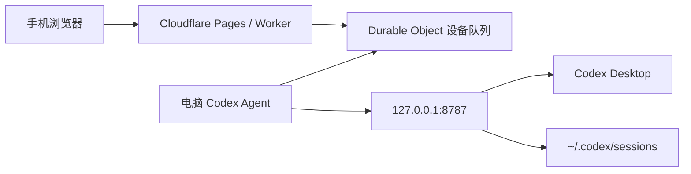

# Cloudflare 中转部署

这个中转方案让手机通过 Cloudflare Pages 或 Worker 访问家里或办公室电脑上的 Codex。真正控制 Codex Desktop 的仍然是电脑本机 `server.js`，Cloudflare 只负责把手机请求转给在线的本机 Agent。

推荐优先部署到 **Cloudflare Pages + 自定义域名**。如果 `workers.dev` 在你的网络环境里无法直连，Pages 自定义域名通常更容易访问。

## 架构



本实现使用 HTTP 长轮询，不要求电脑开放公网端口，也不需要给 Node 项目安装额外依赖。

## 部署 Pages

1. 安装并登录 Wrangler。

```bash
npm install -g wrangler
wrangler login
```

2. 部署内部 Durable Object Worker。Pages 会通过 binding 调用它，外部用户不需要访问这个 Worker 域名。

```bash
cp cloudflare/wrangler.toml.example cloudflare/wrangler.toml
cd cloudflare
wrangler deploy
cd ..
```

3. 复制 Pages 示例配置。

```bash
cp cloudflare/pages/wrangler.toml.example cloudflare/pages/wrangler.toml
```

4. 创建 Pages 项目。

```bash
wrangler pages project create codexpanel --production-branch main
```

5. 可选：在 `cloudflare/pages/wrangler.toml` 的 `[vars]` 里设置设备白名单。

```toml
[vars]
DEVICE_IDS = "my-mac"
```

6. 部署 Pages advanced mode 入口。

```bash
cd cloudflare/pages
wrangler pages deploy . --project-name codexpanel --branch main
```

部署后记下 Pages 地址，或者绑定自己的 Cloudflare Pages 自定义域名，例如：

```text
https://codexpanel.pages.dev
https://codex.example.com
```

`cloudflare/pages/_worker.js` 是 Pages advanced mode 入口；`cloudflare/relay-worker.mjs` 定义 Durable Object 队列。这个 Pages 项目只托管中转函数；手机访问 `/remote/<deviceId>/` 时，前端页面和后续 API 都会通过中转从电脑端本地服务取得。

### Codex 默认部署

```text
https://codexpanel.pages.dev
```

本项目的 `server.js` 默认远程地址已经指向这个 Pages 域名；如需换成自己的域名，设置 `CODEX_RELAY_URL` 即可。

## Worker 备用部署

如果你仍然想部署到 Worker，可以使用 `cloudflare/relay-worker.mjs`：

```bash
cp cloudflare/wrangler.toml.example cloudflare/wrangler.toml
cd cloudflare
wrangler deploy
```

## 启动电脑端 Agent

电脑上仍然正常运行 Codex 本地服务，只需要额外配置 2 个环境变量：

```bash
export CODEX_RELAY_URL="https://codex.example.com"
export CODEX_RELAY_DEVICE_ID="my-mac"
node server.js
```

启动日志里会多打印一个远程入口：

```text
Remote URL: https://codex.example.com/remote/my-mac/?token=<本机 Codex token>
```

手机打开这个 URL 后，页面会经由 Cloudflare 中转调用电脑上的本地 Codex。

## macOS App / LaunchAgent

如果你用 macOS 壳应用启动服务，需要把同样的环境变量写入 LaunchAgent。开源版 `ServiceManager.swift` 目前只写入本地运行所需变量；可以自行扩展 `writeLaunchAgent(token:)`，补入：

```xml
<key>CODEX_RELAY_URL</key><string>https://codex.example.com</string>
<key>CODEX_RELAY_DEVICE_ID</key><string>my-mac</string>
```

## 安全建议

- 电脑端 Agent 不需要额外验证密钥；Cloudflare 只按设备 ID 接收 Agent 长轮询。
- 手机 URL 里的 `token` 仍然是本机 Codex 的访问令牌，泄露后别人可以远程控制你的 Codex。
- 建议给 Pages 自定义域名加 Cloudflare Access，至少再套一层登录保护。
- 建议设置 `DEVICE_IDS` 白名单。
- 不要把远程 URL 发到群聊、工单或公开页面。

## 当前限制

- 这是请求/响应中转，不是流式 WebSocket；移动端仍然使用原本的轮询刷新状态。
- 大附件会经过 Worker 和 Durable Object，受 Cloudflare 请求体限制约束。
- 电脑休眠、Codex Desktop 未启动、辅助功能权限缺失时，中转在线也无法完成桌面控制。
